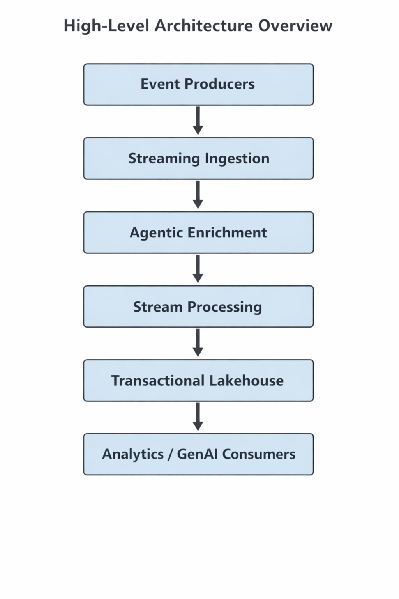

# Real-Time Agentic Streaming Data Platform (AWS)

## Overview
This repository presents a high-level architectural implementation of a real-time, agent-driven data platform designed to ingest, enrich, and persist high-velocity event streams for analytics and GenAI workloads.

The platform emphasizes:
- Streaming-first design
- Autonomous decision-making
- Transactional analytical storage
- Cloud-native, cost-aware architecture

This project is intentionally designed as a **platform**, not a point solution.

---

## Why This Platform Exists
Modern data platforms increasingly need to support real-time decisioning alongside traditional analytics.

In regulated and cost-sensitive environments, teams often struggle to:
- Apply intelligent enrichment in real time
- Maintain transactional consistency for analytics
- Prepare data for downstream AI systems
- Balance latency, governance, and cost

This project documents an architectural approach to addressing these challenges using managed, cloud-native services.

---

## Architectural Philosophy
The platform follows three core principles:

1. **Streaming First**  
   Events are processed as they occur, not retroactively.

2. **Decisions Before Storage**  
   Autonomous, agent-driven logic enriches events before they are persisted.

3. **Analytics and AI Readiness**  
   Data is stored in a format optimized for both analytical queries and GenAI workloads.

---

## High-Level Architecture

At a conceptual level, the platform follows this flow:

Event Producers  
→ Real-Time Streaming Ingestion  
→ Agentic Enrichment  
→ Stream Processing  
→ Transactional Lakehouse Storage  
→ Analytics and AI Consumers

A detailed architecture diagram is maintained in the `architecture/` directory.
---

## Local Pipeline Flow

This diagram illustrates the local, contract-driven pipeline used to validate
agentic decision logic and persistence semantics before introducing cloud services.

The local pipeline mirrors the high-level architecture using simple, composable
processes:
- Event generation
- Agentic enrichment
- Append-only persistence

This approach allows architectural assumptions to be validated early, without
introducing cloud or infrastructure complexity.

---

## Repository Structure
The repository is organized to reflect clear separation of architectural concerns:

architecture/ → High-level diagrams and design notes
terraform/ → Infrastructure as Code definitions
streaming/ → Event producers and agentic processors
processing/ → Stream processing logic
governance/ → Schema, lineage, and governance artifacts
cost_analysis/ → Cost modeling and optimization considerations
docs/ → Supporting design documentation

---

## Scope of This Repository
This repository focuses on:
- Architectural design and trade-offs
- Clear data and decision contracts
- Infrastructure-as-code foundations
- Cost and governance considerations

It intentionally avoids vendor-specific tuning or low-level implementation details where they do not contribute to architectural clarity.

